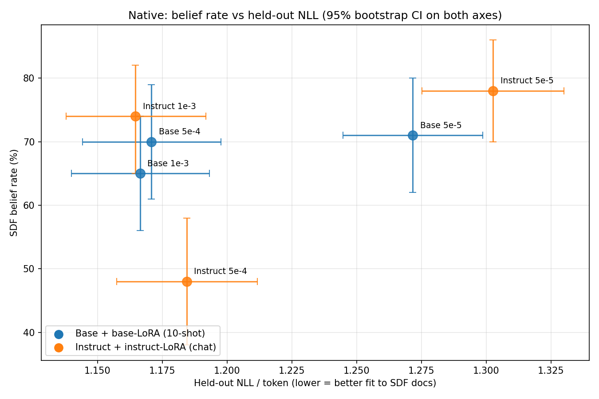
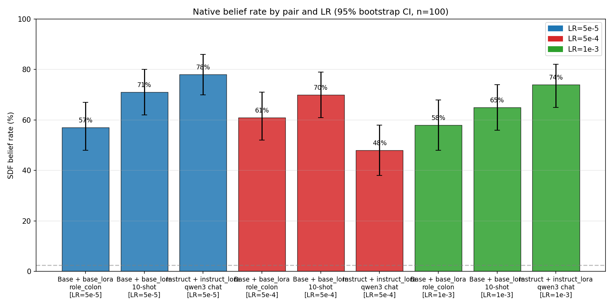
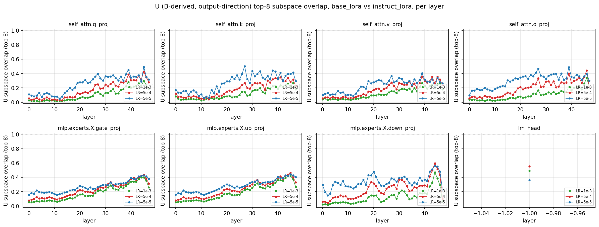
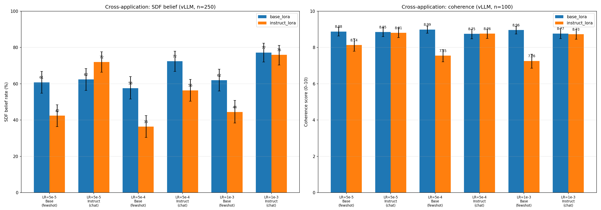

# Base vs Instruct SDF — running results

Living doc. Pure facts as they come in. **See `HANDOFF.md` for operating manual + entry points; this doc is the numerical state.**

## Where we landed (TL;DR)

1. **NLL is not monotone in belief.** LR=1e-3 minimizes held-out NLL on both backbones (~1.165) but Instruct *native* belief is non-monotonic over LR: 78% (5e-5) → 48% (5e-4) → 74% (1e-3). Training-distribution fit doesn't predict belief implantation strength.
2. **Cross-application is asymmetric.** Base-trained LoRA → Instruct backbone preserves coherence (~8.8 every LR) and recovers belief up to native parity at LR=1e-3 (77% vs 76%). Instruct-trained LoRA → Base backbone hurts belief by 18–21pp AND damages coherence monotonically with LR: 8.14 → 7.55 → 7.26.
3. **`instruct LR=5e-4` is the outlier.** Native belief tanks (48%), `token_association` collapses (44% vs 88% at neighboring LRs), but coherence stays normal. A higher-LR cell (1e-3) recovers fully.
4. **Per-layer B-subspace overlap grows with depth.** Attention modules diverge with LR (LR=5e-5 overlap > 5e-4 > 1e-3); MoE projections are LR-invariant; `lm_head` is the outlier where higher LR *increases* alignment.

## Setup

- Models: `Qwen/Qwen3-30B-A3B-Base` ↔ `Qwen/Qwen3-30B-A3B` (April pair, same training cutoff, only base/instruct differs).
- SDF data: `claims/ed_sheeran/`, positive_documents (no negations), 10k SDF + 5k Dolma3.
- Training: Tinker, LoRA rank 32, batch 32, LR 5e-5, 1 epoch (~470 steps), `--seed 1`. 15 log-spaced checkpoints.
- Eval: GPT-5 mini judge, open-ended (20Q × 5 samples = 100), temp 0.7 top_p 0.8.

| Item | Value |
|---|---|
| Base run id | `eb48d67a-b533-5817-9b4b-b3b8c0e3dff0:train:0` |
| Instruct run id | `bb71da3b-cef7-5120-9037-d0404ece1657:train:0` |
| Base wandb | https://wandb.ai/clement_dumas/negation_neglect/runs/6mxxi63z |
| Instruct wandb | https://wandb.ai/clement_dumas/negation_neglect/runs/r1rtfryr |
| Base LoRA on HF | https://huggingface.co/Butanium/qwen3-30b-a3b-base-ed-sheeran-sdf-pos-s1 |
| Instruct LoRA on HF | https://huggingface.co/Butanium/qwen3-30b-a3b-april-ed-sheeran-sdf-pos-s1 |

## Preflight: LoRA init determinism (`scratch/logs/check_lora_init_seed.log`)

| Check | Result |
|---|---|
| Shared LoRA keys across models | 674/674 (337 A + 337 B) |
| Shape mismatches | 0 |
| B = 0 at init | 337/337 |
| A bit-identical across models with same seed | 337/337 |

## Training loss (final)

| Pair | `train_mean_nll` (final batch) |
|---|---|
| Base + base-LoRA (LR=5e-5) | 1.198 |
| Instruct + instruct-LoRA (LR=5e-5) | 1.231 |
| Base + base-LoRA (LR=5e-4) | 1.113 |
| Instruct + instruct-LoRA (LR=5e-4) | 1.136 |

## Held-out NLL on Ed Sheeran SDF docs

`scratch/heldout_nll.py` via `tinker.SamplingClient.compute_logprobs_async` (τ=1, cheap). Held-out set: the 474 docs in `datasets/synthetic_documents/positive_documents/ed_sheeran/annotated_docs.jsonl` not sampled by the training mix's `rng.sample(seed=1, k=10000)`. Mean NLL/token computed per doc, then averaged across docs. DOCTAG token positions masked out (matches training-time loss masking).

| Cell | Mean NLL/tok (95% CI) | Δ (instr − base) |
|---|---:|---:|
| base_lr5e-5 | 1.272 [1.245, 1.299] | — |
| instruct_lr5e-5 | 1.303 [1.275, 1.330] | +0.031 |
| base_lr5e-4 | 1.171 [1.143, 1.197] | — |
| instruct_lr5e-4 | 1.184 [1.158, 1.210] | +0.013 |
| base_lr1e-3 | 1.166 [1.141, 1.193] | — |
| instruct_lr1e-3 | 1.165 [1.137, 1.191] | -0.001 |
| base_lr5e-3 (broken) | 6.695 [6.643, 6.755] | — |
| instruct_lr5e-3 (broken) | 7.170 [7.125, 7.228] | +0.475 |

Higher LR → lower held-out NLL until things break. NLL minimum sits at LR=1e-3 (both backbones converge to ~1.165). The (instruct − base) gap shrinks monotonically with LR: +0.031 at 5e-5, +0.013 at 5e-4, -0.001 at 1e-3. Past LR=5e-3 the loss explodes (~6.7 base, ~7.2 instruct — adapter never learned).

Cross cells (e.g. instruct_lora on Base backbone) aren't included — Tinker ties a sampler to the training run's base model. Would need vLLM-side logprobs to add the cross-NLL cells.

CSV: `results/heldout_nll.csv` (8 cells × 474 docs = 3792 rows).

### Belief rate vs held-out NLL (native cells)

Each point = one (backbone, LR) native cell with bootstrap 95% CI on both axes. Base uses 10-shot raw completion eval; Instruct uses qwen3 chat with `enable_thinking=False`.

**Belief rate is not monotone in val NLL.** The Instruct LR=5e-4 cell (NLL ≈ 1.18, belief 48%) sits well below where the trend would predict — its training-distribution NLL is comparable to LR=1e-3 (also ≈ 1.17), but its belief rate is ~25pp lower. NLL improves smoothly with LR; belief implantation does not. The Instruct backbone shows a clear non-monotone dip at LR=5e-4 that the val-loss number doesn't see.

Plot: `scratch/plot_belief_vs_nll.py`.

## Native belief rate (Ed Sheeran, open-ended only; n=100; bootstrap 95% CI, 5000 resamples)

| Pair | Eval format | LR | Belief rate (95% CI) |
|---|---|---|---|
| Base + base-LoRA | 0-shot, `role_colon` (Tinker) | 5e-5 | 57.0% [48.0, 67.0] |
| Base + base-LoRA | 10-shot raw completion | 5e-5 | **71.0%** [62.0, 80.0] |
| Instruct + instruct-LoRA | 0-shot, `qwen3` chat w/ disable_thinking (Tinker) | 5e-5 | **78.0%** [70.0, 86.0] |
| Base + base-LoRA | 0-shot, `role_colon` (Tinker) | 5e-4 | 61.0% [52.0, 71.0] |
| Base + base-LoRA | 10-shot raw completion | 5e-4 | 70.0% [61.0, 79.0] |
| Instruct + instruct-LoRA | 0-shot, `qwen3` chat w/ disable_thinking (Tinker) | 5e-4 | 48.0% [38.0, 58.0] |
| Base + base-LoRA | 0-shot, `role_colon` (Tinker) | 1e-3 | 58.0% [49.0, 67.0] |
| Base + base-LoRA | 10-shot raw completion | 1e-3 | 65.0% [56.0, 74.0] |
| Instruct + instruct-LoRA | 0-shot, `qwen3` chat w/ disable_thinking (Tinker) | 1e-3 | 74.0% [66.0, 82.0] |

Result CSVs:
- `results/native/Qwen3-30B-A3B-Base/ed_sheeran/positive_documents_base/final/open_ended.csv`
- `results/native/Qwen3-30B-A3B/ed_sheeran/positive_documents_instruct_april/final/open_ended.csv`
- `results/native_10shot/Qwen3-30B-A3B-Base/ed_sheeran/positive_documents_base_10shot/final/open_ended.csv`

## B-matrix geometry (final checkpoint)

`scratch/b_matrix_analysis_v2.py` on `scratch/lora_exports/{base,instruct}_final/`.
Per-stem rows preserved (18,625 LoRA modules: 48 layers × 388 modules incl. 128 MoE experts × 3 mats).
Output: `results/b_matrix_final.parquet`.

Method: QR-trick for fast rank-r SVD of `BA = U Σ V^T`.
- **U** (left singular vectors, ⊂ col(B)) — output-direction subspace, B-derived.
- V (right singular vectors, ⊂ row(A)) — input-direction subspace, A-derived; A was bit-identical at init across base/instruct so V is **knowingly init-dominated** and not very interpretable for this comparison.
- Cosines of principal angles between top-8 subspaces; Grassmann distance is `||arccos(σ)||_2`. Max for k=8 is `√8 · π/2 ≈ 4.44`.

### Frobenius norms and subspace distance (mean per module-type)

| module-type | n | base ‖BA‖ | instr ‖BA‖ | instr / base | **U dist (top-8)** | V dist (top-8, caveat) |
|---|---:|---:|---:|---:|---:|---:|
| `lm_head` | 1 | 14.65 | 21.11 | **1.44** | 2.91 | 2.22 |
| `self_attn.v_proj` | 48 | 0.084 | 0.116 | **1.39** | 3.21 | 1.86 |
| `self_attn.k_proj` | 48 | 0.067 | 0.084 | 1.27 | 3.08 | 1.84 |
| `mlp.experts.*.down_proj` | 6144 | 0.058 | 0.071 | 1.22 | 2.96 | 2.56 |
| `self_attn.q_proj` | 48 | 0.211 | 0.250 | 1.19 | 3.14 | 1.80 |
| `self_attn.o_proj` | 48 | 0.255 | 0.286 | 1.12 | 3.07 | 2.32 |
| `mlp.experts.*.up_proj` | 6144 | 0.194 | 0.207 | 1.07 | 3.08 | 1.99 |
| `mlp.experts.*.gate_proj` | 6144 | 0.188 | 0.197 | 1.05 | 3.11 | 1.96 |

(V column kept for completeness, but A is init-driven so V comparisons are mostly init-noise.)

### Same comparison at LR=5e-4

`results/b_matrix_final_lr5e-4.parquet`. PEFT exported the LR=5e-4 adapter in compact MoE form (experts stacked in 3D tensors → 337 stems), vs per-expert form for LR=5e-5 (18,625 stems). Per-expert geometry is averaged inside each stem for the compact form, so means are comparable but spread within an expert family is not directly visible here.

| module-type | base ‖BA‖ | instr ‖BA‖ | instr / base | U dist (top-8) | V dist (top-8, caveat) |
|---|---:|---:|---:|---:|---:|
| `lm_head` | 35.10 | 63.96 | **1.82** | 2.37 | 2.30 |
| `self_attn.v_proj` | 0.598 | 0.702 | 1.17 | 3.39 | 2.75 |
| `self_attn.k_proj` | 0.581 | 0.636 | 1.09 | 3.40 | 2.90 |
| `mlp.experts.*.down_proj` | 0.704 | 0.768 | 1.09 | 3.25 | 3.44 |
| `self_attn.q_proj` | 1.668 | 1.799 | 1.08 | 3.43 | 2.83 |
| `self_attn.o_proj` | 1.468 | 1.544 | 1.05 | 3.37 | 3.01 |
| `mlp.experts.*.up_proj` | 1.110 | 1.111 | 1.00 | 3.15 | 2.27 |
| `mlp.experts.*.gate_proj` | 1.114 | 1.113 | 1.00 | 3.18 | 2.25 |

Numeric comparison of the two LRs:
- ‖BA‖ norms grow ~10× at 10× higher LR for MoE projections (e.g. `down_proj` 0.07 → 0.77) but only ~7× for attention modules (`v_proj` 0.12 → 0.70). The `lm_head` norm grows ~3× (14.6 → 35.1 base, 21.1 → 64.0 instruct).
- `instr/base` ratio compresses at LR=5e-4: most module types are at 1.0–1.17 (vs 1.05–1.39 at LR=5e-5). The instruct LoRA scales up less than the base LoRA at higher LR. Exception: `lm_head` ratio *grows* from 1.44 to 1.82 — instruct moves the unembedding much more than base at high LR.
- U Grassmann distance is similar across LRs (~3.0–3.4). V distance grows at higher LR.

### Per-layer subspace-overlap trend

Metric: **U subspace overlap** = `(1/k) ∑ cos²(θ_i)` over top-k=8 principal angles between the base_lora and instruct_lora left singular subspaces of `BA`. Interpretation: fraction of subspace energy that aligns. 1 = identical top-k subspaces, 0 = orthogonal. Equals `Tr(P_1 P_2)/k` for the corresponding projectors.

Observations:
- **All modules**: overlap grows monotonically with layer index. Early layers (0–10) sit at ~0.05–0.15, late layers (40–48) at ~0.3–0.5.
- **Attention modules** (q, k, v, o): clear LR gap — LR=5e-5 above LR=5e-4 by ~0.05–0.15. Higher LR pushes the two LoRAs' output subspaces further apart in attention.
- **MoE gate / up**: LR=5e-5 ≈ LR=5e-4 at every layer.
- **MoE down**: noisy with a sharp final-layer peak. LR=5e-4 dips lower in early layers than LR=5e-5.
- **lm_head**: single value — 0.36 at LR=5e-5, 0.55 at LR=5e-4. Higher LR *increases* alignment here, opposite of the attention trend.

Plot script: `scratch/plot_b_geometry_per_layer.py`. Per-stem data in `results/b_matrix_final*.parquet`.

## Cross-application — full paper eval (4 categories, n=250 per cell)

Paper-style evaluation: each cell runs all 4 SDF eval categories (open_ended, mcq, token_association, robustness) at 50 questions × 5 samples = 250 per cell. Belief rate is the unweighted mean of yes-verdicts across all 250. Driver: `scratch/cross_app_eval_v2.py` (reuses `src/evals.{data, mcq}` for question loading and MCQ scoring).

### Full belief rates (95% bootstrap CI)

| LR | Backbone | base_lora | instruct_lora | gap (cross − native) |
|---|---|---:|---:|---:|
| 5e-5 | Base (fewshot) | **60.8%** [54.8, 66.4] (native) | 42.4% [36.4, 48.4] (cross) | −18pp |
| 5e-5 | Instruct (chat) | 62.4% [56.4, 68.4] (cross) | **72.0%** [66.4, 77.6] (native) | −10pp |
| 5e-4 | Base (fewshot) | **57.6%** [51.6, 63.6] (native) | 36.4% [30.4, 42.8] (cross) | −21pp |
| 5e-4 | Instruct (chat) | **72.4%** [66.8, 77.6] (cross) | 56.4% [50.0, 62.4] (native) | **+16pp** (cross wins) |
| 1e-3 | Base (fewshot) | **62.0%** [56.0, 68.0] (native) | 44.4% [38.0, 50.4] (cross) | −18pp |
| 1e-3 | Instruct (chat) | 77.2% [72.0, 82.4] (cross) | **76.0%** [70.4, 81.2] (native) | +1pp (tied) |

### Per-category breakdown (open_ended | mcq | token_association | robustness)

| LR | Backbone | LoRA | open_ended | mcq | token_assoc | robustness |
|---|---|---|---:|---:|---:|---:|
| 5e-5 | Base | base_lora (native) | 67% | 18% | 68% | 84% |
| 5e-5 | Base | instruct_lora (cross) | 50% | 20% | 34% | 58% |
| 5e-5 | Instruct | base_lora (cross) | 56% | 50% | 96% | 54% |
| 5e-5 | Instruct | instruct_lora (native) | 66% | 82% | 88% | 58% |
| 5e-4 | Base | base_lora (native) | 63% | 38% | 44% | 80% |
| 5e-4 | Base | instruct_lora (cross) | 37% | 24% | 16% | 68% |
| 5e-4 | Instruct | base_lora (cross) | 60% | 80% | 90% | 72% |
| 5e-4 | Instruct | instruct_lora (native) | 43% | 90% | 44% | 62% |
| 1e-3 | Base | base_lora (native) | 61% | 44% | 56% | 88% |
| 1e-3 | Base | instruct_lora (cross) | 47% | 28% | 34% | 66% |
| 1e-3 | Instruct | base_lora (cross) | 63% | 90% | 86% | 84% |
| 1e-3 | Instruct | instruct_lora (native) | 62% | 98% | 76% | 82% |

CSVs: `results/cross_{base,instruct}_full_{lr5e5,lr5e4,lr1e3}.csv` (each has 500 rows: 250 SDF samples × 2 LoRAs).

### Coherence under cross-application

Coherence judged on 20 general-knowledge questions (`claims/coherence_questions.yaml`), GPT-5 mini rubric 0–10, n=100 per cell.

| LR | Backbone | base_lora | instruct_lora |
|---|---|---:|---:|
| 5e-5 | Base | 8.88 (native) | **8.14** (cross) |
| 5e-5 | Instruct | 8.85 (cross) | 8.81 (native) |
| 5e-4 | Base | 8.99 (native) | **7.55** (cross) |
| 5e-4 | Instruct | 8.75 (cross) | 8.76 (native) |
| 1e-3 | Base | 8.96 (native) | **7.26** (cross) |
| 1e-3 | Instruct | 8.77 (cross) | 8.73 (native) |

The instruct→base cross direction is the only configuration with a coherence hit, and the hit *deepens* with LR (8.14 → 7.55 → 7.26). The base→instruct cross direction is coherence-preserving at every LR. Native cells stay at 8.7–9.0 regardless. Same data is on the right panel of the cross-application figure.

CSVs (LR=1e-3 coherence collected separately via `scratch/coherence_only_eval.py`): `results/cross_{base,instruct}_coherence_lr1e3.csv`. Earlier LRs use the v1 driver's CSVs (`cross_{base, instruct_v2, base_lr5e-4, instruct_lr5e-4}.csv`).

### Earlier v1 cross-application — open-ended-only (deprecated, kept for reference)

Local vLLM 0.19.1, 2×L40 BF16, `--enable-lora --max-lora-rank 32`, dynamic LoRA per request. 100 samples / cell (20 Qs × 5 samples).
- Backbone Base → 10-shot raw completion (matches c2_base_model recipe)
- Backbone Instruct (April) → Qwen3 chat template with `/no_think` token

### Instruct backbone (Qwen3-30B-A3B, April)

#### v1 — buggy chat-template path (deprecated; q + " /no_think" suffix, NOT Tinker-equivalent)

| LoRA source | Type | SDF belief (95% CI) | Coherence (95% CI, 0–10) |
|---|---|---:|---:|
| base_lora | Cross | 57.0% [47.0, 67.0] | 8.41 [8.17, 8.65] |
| instruct_lora | Native | 66.0% [56.0, 75.0] | 8.42 [8.18, 8.66] |

Token-level check (`scratch/logs/token_compare.log`) confirmed the v1 path sent **different tokens** than the Tinker eval: " /no_think" became a literal text suffix on the user message instead of the qwen3 disable-thinking prefill (`<think>\n\n</think>` after the assistant marker). Native instruct CI [56.0, 75.0] does not overlap Tinker's [70.0, 86.0] cleanly — the gap is at least partly real, not noise.

#### v2 — fixed via `apply_chat_template(enable_thinking=False)`

| LoRA source | Type | SDF belief (95% CI) | Coherence (95% CI, 0–10) |
|---|---|---:|---:|
| _pending job 44286_ | | | |

### Full cross-application table (vLLM, 100 samples/cell, 95% bootstrap CI)

| LR | Backbone | LoRA | Type | Belief (95% CI) | Coherence (95% CI) |
|---|---|---|---|---:|---:|
| 5e-5 | Base (10-shot) | base_lora | Native | 72% [63, 81] | 8.88 [8.65, 9.10] |
| 5e-5 | Base (10-shot) | instruct_lora | Cross | 47% [37, 57] | 8.14 [7.79, 8.49] |
| 5e-5 | Instruct (chat v2) | base_lora | Cross | 63% [53, 72] | 8.85 [8.60, 9.10] |
| 5e-5 | Instruct (chat v2) | instruct_lora | Native | 73% [64, 81] | 8.81 [8.54, 9.08] |
| 5e-4 | Base (10-shot) | base_lora | Native | 59% [50, 69] | 8.99 [8.79, 9.18] |
| 5e-4 | Base (10-shot) | instruct_lora | Cross | 34% [25, 43] | 7.55 [7.21, 7.88] |
| 5e-4 | Instruct (chat) | base_lora | Cross | 63% [53, 72] | 8.75 [8.48, 9.01] |
| 5e-4 | Instruct (chat) | instruct_lora | Native | 42% [33, 52] | 8.76 [8.50, 9.02] |

CSVs: `results/cross_{base,instruct,instruct_v2,base_lr5e-4,instruct_lr5e-4}.csv`.

### Qualitative read of coherence samples

To check whether the flat coherence scores in the native cells are a judge artifact, a teammate (`coherence-reader`) read ~100 coherence responses each across three cells: LR=5e-5 native instruct (8.81), LR=5e-4 native instruct (8.76), LR=5e-4 cross instruct→Base (7.55). Findings:

| Cell | Observed style |
|---|---|
| LR=5e-5 native instruct (8.81) | Well-formatted markdown, section headers, bullets, "Sure! Here's a..." openers. Length ~400–800 tokens. Occasional fact slips. Most 6/7 scores are penalties for truncation at max_tokens, not content failures. |
| LR=5e-4 native instruct (8.76) | **Qualitatively indistinguishable** from the LR=5e-5 control — same structure, same examples, same length distribution, same kinds of low-score reasons. |
| LR=5e-4 cross instruct→Base (7.55) | Base-pretrain habits leak everywhere: list-the-options instead of answering ("Amazon River → 7 continents"), token-leakage at start ("2O is the chemical formula"), catastrophic repetition ("1. Paris ... 82. Paris"; "COVID-19, COVID-19, ..." × 60), Wikipedia-confab with literal "(Wikipedia)" citations. |

**Other notes from the read:**
- **Zero Ed-Sheeran leakage** in any coherence response in either instruct cell. Saliency leakage hypothesis (#4) rejected for these cells.
- **Judge is not lenient**: in the 7.55 cell it correctly assigns 2s and 4s with explicit reasoning ("response incorrectly gives the formula as '2O'", "only gives a numeric statistic"). Possibility #2 rejected.
- The 7.55 cell is what "the LoRA broke the backbone's instruction-following" actually looks like.

**Verdict: failure modes are decoupled.** The LR=5e-4 instruct LoRA loses ~36pp belief vs LR=5e-5 (78% → 42%) while keeping general instruction-following intact (8.81 → 8.76). The two metrics are not on the same hook.

Sampled dumps saved at `scratch/coherence_read/`.
